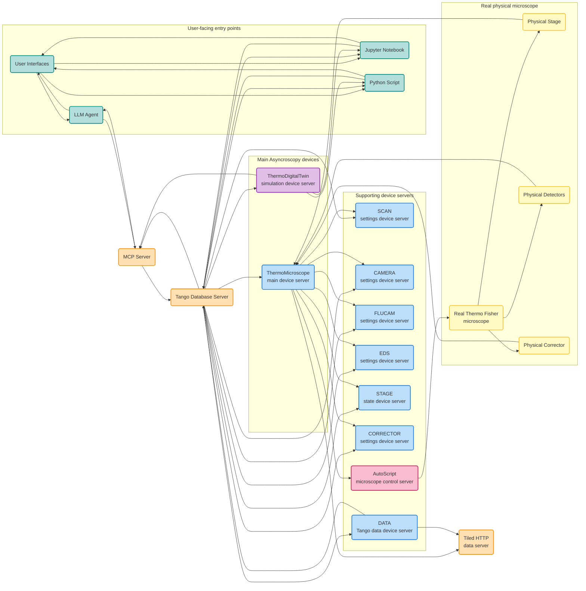

# Asyncroscopy Block Diagram

This diagram shows the main Asyncroscopy components at a high level: user interfaces, servers, Tango device servers, and real physical devices.

```mermaid
graph LR
%% Nodes
UI("User Interfaces"):::green
LLM("LLM Agent"):::green
Notebook("Jupyter Notebook"):::green
Script("Python Script"):::green

MCP("MCP Server"):::orange
Tango("Tango Database Server"):::orange
TiledServer("Tiled HTTP<br>data server"):::orange

Thermo("ThermoMicroscope<br>main device server"):::blue
Twin("ThermoDigitalTwin<br>simulation device server"):::purple

Scan("SCAN<br>settings device server"):::blue
Camera("CAMERA<br>settings device server"):::blue
Flucam("FLUCAM<br>settings device server"):::blue
Eds("EDS<br>settings device server"):::blue
StageServer("STAGE<br>state device server"):::blue
CorrectorServer("CORRECTOR<br>settings device server"):::blue
DataDevice("DATA<br>Tango data device server"):::blue

AutoScript("AutoScript<br>microscope control server"):::pink
Microscope("Real Thermo Fisher<br>microscope"):::yellow
PhysicalStage("Physical Stage"):::yellow
PhysicalDetectors("Physical Detectors"):::yellow
PhysicalCorrector("Physical Corrector"):::yellow

%% Stacks
subgraph UserStack["User-facing entry points"]
direction TB
UI
LLM
Notebook
Script
end

subgraph CoreStack["Main Asyncroscopy devices"]
direction TB
Thermo
Twin
end

subgraph SupportStack["Supporting device servers"]
direction TB
Scan
Camera
Flucam
Eds
StageServer
CorrectorServer
DataDevice
AutoScript
end

subgraph PhysicalStack["Real physical microscope"]
direction TB
Microscope
PhysicalStage
PhysicalDetectors
PhysicalCorrector
end

%% Edges
UI --> LLM
UI --> Notebook
UI --> Script

LLM --> MCP
MCP --> Tango
Notebook --> Tango
Script --> Tango

Tango --> Thermo
Tango --> Twin

Tango --> Scan
Tango --> Camera
Tango --> Flucam
Tango --> Eds
Tango --> StageServer
Tango --> CorrectorServer
Tango --> DataDevice

Thermo --> Scan
Thermo --> Camera
Thermo --> Flucam
Thermo --> Eds
Thermo --> StageServer
Thermo --> CorrectorServer

Thermo --> AutoScript
AutoScript --> Microscope
Microscope --> PhysicalStage
Microscope --> PhysicalDetectors
Microscope --> PhysicalCorrector

PhysicalStage --> Thermo
PhysicalDetectors --> Thermo
PhysicalCorrector --> Thermo

Thermo --> TiledServer
DataDevice --> TiledServer
DataDevice --> Tango
Tango --> MCP
Tango --> Notebook
Tango --> Script
MCP --> LLM
LLM --> UI
Notebook --> UI
Script --> UI

Twin --> Notebook
Twin --> Script
Twin --> MCP

    %% Styling
    classDef green fill:#B2DFDB,stroke:#00897B,stroke-width:2px;
    classDef orange fill:#FFE0B2,stroke:#FB8C00,stroke-width:2px;
    classDef blue fill:#BBDEFB,stroke:#1976D2,stroke-width:2px;
    classDef yellow fill:#FFF9C4,stroke:#FBC02D,stroke-width:2px;
    classDef pink fill:#F8BBD0,stroke:#C2185B,stroke-width:2px;
    classDef purple fill:#E1BEE7,stroke:#8E24AA,stroke-width:2px;           
```
